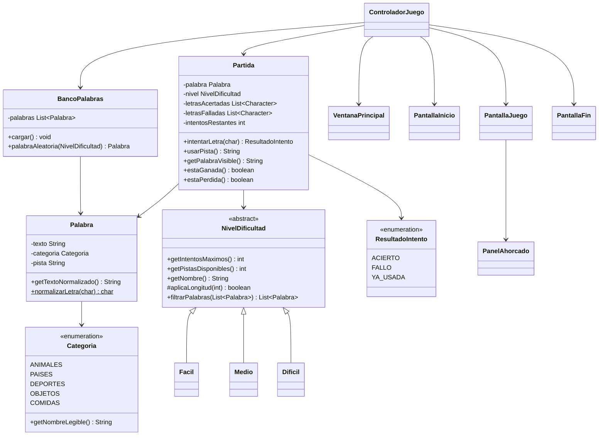

# Diagrama de clases — Juego del Ahorcado

> Exportar a imagen (PNG) para incluir en el manual de usuario PDF.
> El bloque Mermaid se renderiza en GitHub directamente. El bloque
> PlantUML se puede exportar en https://www.plantuml.com/plantuml

## Mermaid



## PlantUML

```plantuml
@startuml
abstract class NivelDificultad {
  +getIntentosMaximos(): int
  +getPistasDisponibles(): int
  +getNombre(): String
  #aplicaLongitud(int): boolean
  +filtrarPalabras(List): List
}
class Facil
class Medio
class Dificil
NivelDificultad <|-- Facil
NivelDificultad <|-- Medio
NivelDificultad <|-- Dificil

enum Categoria { ANIMALES PAISES DEPORTES OBJETOS COMIDAS }
class Palabra {
  -texto: String
  -categoria: Categoria
  -pista: String
  +getTextoNormalizado(): String
}
class BancoPalabras {
  -palabras: List<Palabra>
  +cargar(): void
  +palabraAleatoria(NivelDificultad): Palabra
}
enum ResultadoIntento { ACIERTO FALLO YA_USADA }
class Partida {
  -letrasAcertadas: List<Character>
  -letrasFalladas: List<Character>
  -intentosRestantes: int
  +intentarLetra(char): ResultadoIntento
  +usarPista(): String
  +estaGanada(): boolean
}
class ControladorJuego
class VentanaPrincipal
class PantallaInicio
class PantallaJuego
class PantallaFin
class PanelAhorcado

Palabra --> Categoria
BancoPalabras --> Palabra
Partida --> Palabra
Partida --> NivelDificultad
Partida --> ResultadoIntento
ControladorJuego --> Partida
ControladorJuego --> BancoPalabras
ControladorJuego --> VentanaPrincipal
PantallaJuego --> PanelAhorcado
@enduml
```
