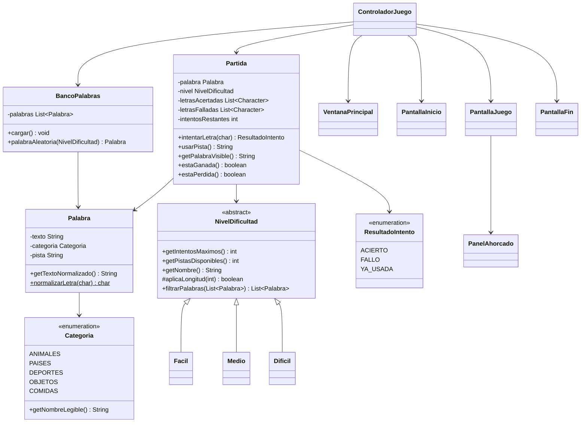

# Juego del Ahorcado con Java Swing — Plan de Implementación

> **For agentic workers:** REQUIRED SUB-SKILL: Use superpowers:subagent-driven-development (recommended) or superpowers:executing-plans to implement this plan task-by-task. Steps use checkbox (`- [ ]`) syntax for tracking.

**Goal:** Construir un juego del ahorcado completo en Java + Swing que cumpla la rúbrica de POO (24 pts): herencia/polimorfismo vía niveles de dificultad, ArrayList, interfaz gráfica con dibujo Java2D, banco de 200 palabras y entregables documentales.

**Architecture:** 3 capas desacopladas — `modelo` (lógica pura, sin Swing, testeable), `vista` (3 pantallas Swing con CardLayout + panel de dibujo Java2D), `controlador` (único punto de unión vista↔modelo). Banco de palabras en archivo de texto cargado a ArrayList. Sin dependencias externas (solo JDK).

**Tech Stack:** Java (JDK 25, código compatible Java 11+), Swing, Java2D. Compilación con `javac`, ejecución con `java`. Pruebas con clase `main` propia (sin JUnit). Git + GitHub CLI (`gh`).

---

## Convenciones de este proyecto (leer antes de empezar)

- **Shell:** PowerShell en Windows. Para compilar todo el proyecto se usa un archivo de respuestas con la lista de fuentes (ver más abajo). Las rutas usan `\` en comandos pero `/` funciona en `javac`.
- **Compilación estándar del proyecto** (se usará repetidamente):

  ```powershell
  # Compila todo src/ + pruebas/ a la carpeta out/
  $archivos = Get-ChildItem -Recurse -Filter *.java -Path src,pruebas | ForEach-Object { $_.FullName }
  javac -encoding UTF-8 -d out $archivos
  ```

- **Ejecutar las pruebas:**

  ```powershell
  java -cp out PruebasPartida
  ```

- **Ejecutar el juego:**

  ```powershell
  java -cp "out;recursos" Main
  ```
  (El `;` separa classpath en Windows; `recursos` se añade para que `palabras.txt` se halle como recurso si se carga vía classpath; el código también soporta ruta de archivo directa `recursos/palabras.txt`.)

- **TDD:** cada clase del modelo se prueba en `pruebas/PruebasPartida.java`, que es un runner manual con aserciones que imprimen `✓`/`✗` y hacen `System.exit(1)` si algo falla (para que el comando "verifique fallo/éxito" tenga código de salida fiable).
- **Encapsulación:** atributos `private`, getters; sin setters salvo donde el plan lo indique.
- **Idioma del código:** nombres de clases/métodos en español (coherente con el enunciado y el diagrama de clases que verá el profesor). Comentarios Javadoc en español.

---

## Mapa de archivos

| Archivo | Responsabilidad |
|---|---|
| `recursos/palabras.txt` | 200 palabras (`categoria;palabra;pista`), 40 por categoría |
| `src/modelo/Categoria.java` | Enum de las 5 categorías con nombre legible |
| `src/modelo/Palabra.java` | Datos inmutables de una palabra + normalización |
| `src/modelo/NivelDificultad.java` | Clase abstracta: intentos, pistas, filtrado polimórfico |
| `src/modelo/Facil.java` | Subclase: 8 intentos, 3-5 letras, 3 pistas |
| `src/modelo/Medio.java` | Subclase: 7 intentos, 6-8 letras, 2 pistas (default) |
| `src/modelo/Dificil.java` | Subclase: 6 intentos, 9+ letras, 1 pista |
| `src/modelo/BancoPalabrasException.java` | Excepción propia de carga del banco |
| `src/modelo/BancoPalabras.java` | Carga archivo → ArrayList; palabra aleatoria por nivel |
| `src/modelo/ResultadoIntento.java` | Enum: ACIERTO, FALLO, YA_USADA |
| `src/modelo/Partida.java` | Estado y reglas: intentar letra, pistas, ganar/perder |
| `src/vista/PanelAhorcado.java` | JPanel Java2D: dibuja horca + muñeco según errores |
| `src/vista/PantallaInicio.java` | Selección de dificultad |
| `src/vista/PantallaJuego.java` | Pantalla principal de juego (teclado, palabra, pistas) |
| `src/vista/PantallaFin.java` | Resultado final + jugar de nuevo |
| `src/vista/VentanaPrincipal.java` | JFrame con CardLayout que aloja las 3 pantallas |
| `src/controlador/ControladorJuego.java` | Une vista↔modelo, maneja eventos |
| `src/Main.java` | Punto de entrada, arranque seguro con manejo de error |
| `pruebas/PruebasPartida.java` | Runner de pruebas de la lógica pura |
| `.gitignore` | Ignora `out/`, `*.class` |
| `README.md` | Descripción, cómo compilar/ejecutar |
| `docs/diagrama-clases.md` | Diagrama de clases (Mermaid + PlantUML) |
| `docs/manual-usuario.md` | Contenido del manual para el PDF |
| `docs/guion-video.md` | Guion sugerido para el video del equipo |

**Orden de construcción:** modelo (con TDD) → pruebas → recurso de palabras → vista → controlador → Main → docs → repo GitHub. El modelo se completa y prueba antes de tocar Swing.

---

## Task 1: Estructura base y .gitignore

**Files:**
- Create: `.gitignore`
- Create: `out/.gitkeep` (carpeta de salida de compilación)

- [ ] **Step 1: Crear `.gitignore`**

```gitignore
# Compilados Java
*.class
/out/
*.jar

# IDE
.idea/
*.iml
.vscode/
.settings/
.classpath
.project

# SO
Thumbs.db
.DS_Store
```

- [ ] **Step 2: Crear carpeta de salida**

Crear el archivo `out/.gitkeep` con contenido vacío (una línea):

```
```

- [ ] **Step 3: Verificar estado git**

Run:
```powershell
git status --short
```
Expected: muestra `.gitignore` y `out/.gitkeep` como nuevos (untracked), NO muestra el repo padre.

- [ ] **Step 4: Commit**

```powershell
git add .gitignore out/.gitkeep
git -c commit.gpgsign=false commit -m "chore: estructura base y .gitignore

Co-Authored-By: Claude Opus 4.7 (1M context) <noreply@anthropic.com>"
```

---

## Task 2: Enum Categoria

**Files:**
- Create: `src/modelo/Categoria.java`
- Create: `pruebas/PruebasPartida.java` (runner inicial)

- [ ] **Step 1: Crear el runner de pruebas con el primer test fallando**

Create `pruebas/PruebasPartida.java`:

```java
import modelo.Categoria;

/**
 * Runner manual de pruebas de la lógica pura (sin Swing).
 * Imprime ✓/✗ por caso y sale con código 1 si alguna falla.
 */
public class PruebasPartida {

    private static int pasadas = 0;
    private static int fallidas = 0;

    public static void main(String[] args) {
        System.out.println("=== Pruebas de la lógica del Ahorcado ===\n");

        pruebaCategoriaTieneCincoValores();

        System.out.println("\n=== Resultado: " + pasadas + " pasadas, " + fallidas + " fallidas ===");
        if (fallidas > 0) {
            System.exit(1);
        }
    }

    static void pruebaCategoriaTieneCincoValores() {
        afirmar("Categoria tiene exactamente 5 valores",
                Categoria.values().length == 5);
        afirmar("Categoria.ANIMALES tiene nombre legible no vacío",
                !Categoria.ANIMALES.getNombreLegible().isBlank());
    }

    // ---- utilidades de aserción ----

    static void afirmar(String descripcion, boolean condicion) {
        if (condicion) {
            pasadas++;
            System.out.println("  ✓ " + descripcion);
        } else {
            fallidas++;
            System.out.println("  ✗ " + descripcion);
        }
    }

    static void afirmarIgual(String descripcion, Object esperado, Object real) {
        boolean ok = (esperado == null && real == null)
                || (esperado != null && esperado.equals(real));
        if (ok) {
            pasadas++;
            System.out.println("  ✓ " + descripcion);
        } else {
            fallidas++;
            System.out.println("  ✗ " + descripcion
                    + " (esperado=" + esperado + ", real=" + real + ")");
        }
    }
}
```

- [ ] **Step 2: Compilar para verificar que falla**

Run:
```powershell
$archivos = Get-ChildItem -Recurse -Filter *.java -Path src,pruebas -ErrorAction SilentlyContinue | ForEach-Object { $_.FullName }
javac -encoding UTF-8 -d out $archivos
```
Expected: FALLA con error de compilación `package modelo does not exist` / `cannot find symbol Categoria` (la clase aún no existe).

- [ ] **Step 3: Crear `src/modelo/Categoria.java`**

```java
package modelo;

/**
 * Categorías del banco de palabras. El enunciado exige al menos 5.
 */
public enum Categoria {
    ANIMALES("Animales"),
    PAISES("Países"),
    DEPORTES("Deportes"),
    OBJETOS("Objetos"),
    COMIDAS("Comidas");

    private final String nombreLegible;

    Categoria(String nombreLegible) {
        this.nombreLegible = nombreLegible;
    }

    /** Nombre para mostrar en la interfaz. */
    public String getNombreLegible() {
        return nombreLegible;
    }

    /**
     * Convierte un texto del archivo (ej. "ANIMALES") a su enum.
     * @throws IllegalArgumentException si no corresponde a ninguna categoría.
     */
    public static Categoria desde(String texto) {
        return Categoria.valueOf(texto.trim().toUpperCase());
    }
}
```

- [ ] **Step 4: Compilar y verificar que pasa**

Run:
```powershell
$archivos = Get-ChildItem -Recurse -Filter *.java -Path src,pruebas | ForEach-Object { $_.FullName }
javac -encoding UTF-8 -d out $archivos
java -cp out PruebasPartida
```
Expected: compila sin errores; salida muestra `✓ Categoria tiene exactamente 5 valores` y `✓ Categoria.ANIMALES...`, `Resultado: 2 pasadas, 0 fallidas`.

- [ ] **Step 5: Commit**

```powershell
git add src/modelo/Categoria.java pruebas/PruebasPartida.java
git -c commit.gpgsign=false commit -m "feat: enum Categoria con 5 categorías y runner de pruebas

Co-Authored-By: Claude Opus 4.7 (1M context) <noreply@anthropic.com>"
```

---

## Task 3: Clase Palabra

**Files:**
- Create: `src/modelo/Palabra.java`
- Modify: `pruebas/PruebasPartida.java` (añadir pruebas de Palabra)

- [ ] **Step 1: Añadir test fallando en el runner**

En `pruebas/PruebasPartida.java`, añadir el import al inicio:

```java
import modelo.Palabra;
```

Y dentro de `main()`, después de `pruebaCategoriaTieneCincoValores();`, añadir:

```java
        pruebaPalabraNormaliza();
```

Y añadir este método nuevo a la clase (antes de las utilidades de aserción):

```java
    static void pruebaPalabraNormaliza() {
        Palabra p = new Palabra("Camión", Categoria.OBJETOS, "Sirve para transportar carga");
        afirmarIgual("getTexto conserva original", "Camión", p.getTexto());
        afirmarIgual("getTextoNormalizado quita tildes y pasa a minúscula",
                "camion", p.getTextoNormalizado());
        afirmarIgual("getCategoria correcta", Categoria.OBJETOS, p.getCategoria());
        afirmarIgual("getPista correcta",
                "Sirve para transportar carga", p.getPista());
        afirmar("normalizarLetra('Á') == 'a'", Palabra.normalizarLetra('Á') == 'a');
        afirmar("normalizarLetra('Ñ') == 'ñ' (la Ñ se conserva)",
                Palabra.normalizarLetra('Ñ') == 'ñ');
    }
```

- [ ] **Step 2: Compilar para verificar que falla**

Run:
```powershell
$archivos = Get-ChildItem -Recurse -Filter *.java -Path src,pruebas | ForEach-Object { $_.FullName }
javac -encoding UTF-8 -d out $archivos
```
Expected: FALLA con `cannot find symbol class Palabra`.

- [ ] **Step 3: Crear `src/modelo/Palabra.java`**

```java
package modelo;

import java.text.Normalizer;

/**
 * Una palabra del banco: su texto, categoría y pista escrita asociada.
 * Inmutable. La normalización permite comparar sin distinguir
 * mayúsculas ni tildes (pero conservando la Ñ como letra propia).
 */
public class Palabra {

    private final String texto;
    private final Categoria categoria;
    private final String pista;

    public Palabra(String texto, Categoria categoria, String pista) {
        this.texto = texto;
        this.categoria = categoria;
        this.pista = pista;
    }

    public String getTexto() {
        return texto;
    }

    public Categoria getCategoria() {
        return categoria;
    }

    public String getPista() {
        return pista;
    }

    /** Longitud en número de letras de la palabra original. */
    public int getLongitud() {
        return texto.length();
    }

    /** Texto en minúsculas y sin tildes (la Ñ se conserva). */
    public String getTextoNormalizado() {
        StringBuilder sb = new StringBuilder(texto.length());
        for (char c : texto.toCharArray()) {
            sb.append(normalizarLetra(c));
        }
        return sb.toString();
    }

    /**
     * Normaliza una sola letra: minúscula y sin tilde, pero la Ñ/ñ
     * se preserva como 'ñ' (es una letra distinta en español).
     */
    public static char normalizarLetra(char c) {
        char min = Character.toLowerCase(c);
        if (min == 'ñ') {
            return 'ñ';
        }
        String sinTilde = Normalizer
                .normalize(String.valueOf(min), Normalizer.Form.NFD)
                .replaceAll("\\p{InCombiningDiacriticalMarks}+", "");
        return sinTilde.isEmpty() ? min : sinTilde.charAt(0);
    }
}
```

- [ ] **Step 4: Compilar y verificar que pasa**

Run:
```powershell
$archivos = Get-ChildItem -Recurse -Filter *.java -Path src,pruebas | ForEach-Object { $_.FullName }
javac -encoding UTF-8 -d out $archivos
java -cp out PruebasPartida
```
Expected: todas las aserciones de Palabra muestran `✓`, `Resultado: 8 pasadas, 0 fallidas`.

- [ ] **Step 5: Commit**

```powershell
git add src/modelo/Palabra.java pruebas/PruebasPartida.java
git -c commit.gpgsign=false commit -m "feat: clase Palabra inmutable con normalización (tildes/Ñ)

Co-Authored-By: Claude Opus 4.7 (1M context) <noreply@anthropic.com>"
```

---

## Task 4: Jerarquía NivelDificultad (herencia + polimorfismo)

**Files:**
- Create: `src/modelo/NivelDificultad.java`
- Create: `src/modelo/Facil.java`
- Create: `src/modelo/Medio.java`
- Create: `src/modelo/Dificil.java`
- Modify: `pruebas/PruebasPartida.java`

- [ ] **Step 1: Añadir test fallando**

En `pruebas/PruebasPartida.java`, añadir imports:

```java
import modelo.NivelDificultad;
import modelo.Facil;
import modelo.Medio;
import modelo.Dificil;
import java.util.ArrayList;
import java.util.List;
```

En `main()`, después de `pruebaPalabraNormaliza();`, añadir:

```java
        pruebaNivelesDificultad();
```

Añadir el método:

```java
    static void pruebaNivelesDificultad() {
        NivelDificultad facil = new Facil();
        NivelDificultad medio = new Medio();
        NivelDificultad dificil = new Dificil();

        afirmarIgual("Fácil: 8 intentos", 8, facil.getIntentosMaximos());
        afirmarIgual("Fácil: 3 pistas", 3, facil.getPistasDisponibles());
        afirmarIgual("Fácil: nombre", "Fácil", facil.getNombre());

        afirmarIgual("Medio: 7 intentos", 7, medio.getIntentosMaximos());
        afirmarIgual("Medio: 2 pistas", 2, medio.getPistasDisponibles());
        afirmarIgual("Medio: nombre", "Medio", medio.getNombre());

        afirmarIgual("Difícil: 6 intentos", 6, dificil.getIntentosMaximos());
        afirmarIgual("Difícil: 1 pista", 1, dificil.getPistasDisponibles());
        afirmarIgual("Difícil: nombre", "Difícil", dificil.getNombre());

        // Polimorfismo: misma llamada, filtrado distinto por longitud
        List<Palabra> banco = new ArrayList<>();
        banco.add(new Palabra("sol", Categoria.OBJETOS, "ilumina de día"));        // 3
        banco.add(new Palabra("camino", Categoria.OBJETOS, "se recorre"));         // 6
        banco.add(new Palabra("biblioteca", Categoria.OBJETOS, "guarda libros"));  // 10

        afirmarIgual("Fácil filtra solo 3-5 letras (sol)",
                1, facil.filtrarPalabras(banco).size());
        afirmarIgual("Medio filtra solo 6-8 letras (camino)",
                1, medio.filtrarPalabras(banco).size());
        afirmarIgual("Difícil filtra solo 9+ letras (biblioteca)",
                1, dificil.filtrarPalabras(banco).size());

        // Polimorfismo real vía referencia a la clase base
        NivelDificultad[] niveles = { facil, medio, dificil };
        int totalFiltrado = 0;
        for (NivelDificultad n : niveles) {
            totalFiltrado += n.filtrarPalabras(banco).size();
        }
        afirmarIgual("Suma de filtrados polimórficos = 3", 3, totalFiltrado);
    }
```

- [ ] **Step 2: Compilar para verificar que falla**

Run:
```powershell
$archivos = Get-ChildItem -Recurse -Filter *.java -Path src,pruebas | ForEach-Object { $_.FullName }
javac -encoding UTF-8 -d out $archivos
```
Expected: FALLA con `cannot find symbol class NivelDificultad`.

- [ ] **Step 3: Crear `src/modelo/NivelDificultad.java`**

```java
package modelo;

import java.util.ArrayList;
import java.util.List;

/**
 * Nivel de dificultad del juego. Clase abstracta: define el contrato
 * y la lógica común de filtrado; las subclases concretan los valores
 * y el criterio de longitud (herencia + polimorfismo).
 */
public abstract class NivelDificultad {

    /** Intentos máximos (errores permitidos) para este nivel. */
    public abstract int getIntentosMaximos();

    /** Cuántas de las 3 pistas están disponibles en este nivel. */
    public abstract int getPistasDisponibles();

    /** Nombre legible del nivel (para la interfaz). */
    public abstract String getNombre();

    /**
     * Indica si una palabra de longitud {@code n} es apta para este nivel.
     * Cada subclase define su rango (método plantilla).
     */
    protected abstract boolean aplicaLongitud(int n);

    /**
     * Filtra el banco dejando solo las palabras aptas para este nivel.
     * Método polimórfico: el comportamiento depende de {@link #aplicaLongitud}.
     */
    public List<Palabra> filtrarPalabras(List<Palabra> banco) {
        List<Palabra> aptas = new ArrayList<>();
        for (Palabra p : banco) {
            if (aplicaLongitud(p.getLongitud())) {
                aptas.add(p);
            }
        }
        return aptas;
    }
}
```

- [ ] **Step 4: Crear `src/modelo/Facil.java`**

```java
package modelo;

/** Nivel fácil: muchos intentos, palabras cortas, todas las pistas. */
public class Facil extends NivelDificultad {

    @Override
    public int getIntentosMaximos() {
        return 8;
    }

    @Override
    public int getPistasDisponibles() {
        return 3;
    }

    @Override
    public String getNombre() {
        return "Fácil";
    }

    @Override
    protected boolean aplicaLongitud(int n) {
        return n >= 3 && n <= 5;
    }
}
```

- [ ] **Step 5: Crear `src/modelo/Medio.java`**

```java
package modelo;

/** Nivel medio (default): 7 intentos como pide el enunciado. */
public class Medio extends NivelDificultad {

    @Override
    public int getIntentosMaximos() {
        return 7;
    }

    @Override
    public int getPistasDisponibles() {
        return 2;
    }

    @Override
    public String getNombre() {
        return "Medio";
    }

    @Override
    protected boolean aplicaLongitud(int n) {
        return n >= 6 && n <= 8;
    }
}
```

- [ ] **Step 6: Crear `src/modelo/Dificil.java`**

```java
package modelo;

/** Nivel difícil: pocos intentos, palabras largas, una sola pista. */
public class Dificil extends NivelDificultad {

    @Override
    public int getIntentosMaximos() {
        return 6;
    }

    @Override
    public int getPistasDisponibles() {
        return 1;
    }

    @Override
    public String getNombre() {
        return "Difícil";
    }

    @Override
    protected boolean aplicaLongitud(int n) {
        return n >= 9;
    }
}
```

- [ ] **Step 7: Compilar y verificar que pasa**

Run:
```powershell
$archivos = Get-ChildItem -Recurse -Filter *.java -Path src,pruebas | ForEach-Object { $_.FullName }
javac -encoding UTF-8 -d out $archivos
java -cp out PruebasPartida
```
Expected: todas las aserciones de niveles `✓`, `Resultado: 22 pasadas, 0 fallidas`.

- [ ] **Step 8: Commit**

```powershell
git add src/modelo/NivelDificultad.java src/modelo/Facil.java src/modelo/Medio.java src/modelo/Dificil.java pruebas/PruebasPartida.java
git -c commit.gpgsign=false commit -m "feat: jerarquía NivelDificultad (abstracta + Fácil/Medio/Difícil)

Herencia y polimorfismo: filtrarPalabras() común, aplicaLongitud()
concretado por cada subclase.

Co-Authored-By: Claude Opus 4.7 (1M context) <noreply@anthropic.com>"
```

---

## Task 5: BancoPalabras y su excepción

**Files:**
- Create: `src/modelo/BancoPalabrasException.java`
- Create: `src/modelo/BancoPalabras.java`
- Modify: `pruebas/PruebasPartida.java`

- [ ] **Step 1: Añadir test fallando**

En `pruebas/PruebasPartida.java`, añadir imports:

```java
import modelo.BancoPalabras;
import modelo.BancoPalabrasException;
import java.io.IOException;
import java.nio.file.Files;
import java.nio.file.Path;
```

En `main()`, después de `pruebaNivelesDificultad();`, añadir:

```java
        pruebaBancoPalabras();
```

Añadir el método:

```java
    static void pruebaBancoPalabras() {
        try {
            // Crear un archivo temporal de prueba
            Path tmp = Files.createTempFile("banco_test", ".txt");
            List<String> lineas = new ArrayList<>();
            lineas.add("ANIMALES;gato;Maulla y caza ratones");
            lineas.add("PAISES;brasil;País del carnaval");
            lineas.add("# comentario que se ignora");
            lineas.add("");                       // vacía: se ignora
            lineas.add("LINEA_MAL_FORMADA");      // sin ';': se ignora
            lineas.add("CATEGORIA_INVALIDA;x;y"); // categoría inexistente: se ignora
            lineas.add("DEPORTES;futbol;Se juega con los pies");
            Files.write(tmp, lineas);

            BancoPalabras banco = new BancoPalabras(tmp.toString());
            banco.cargar();

            afirmarIgual("Banco carga 3 palabras válidas (ignora 4 inválidas)",
                    3, banco.getCantidad());
            afirmar("palabraAleatoria(Facil) devuelve no nulo",
                    banco.palabraAleatoria(new Facil()) != null);
            // 'gato'(4) apta para Fácil; 'brasil'(6) y 'futbol'(6) para Medio
            afirmarIgual("Banco filtra 1 palabra para Fácil (gato)",
                    "gato", banco.palabraAleatoria(new Facil()).getTexto());

            Files.deleteIfExists(tmp);
        } catch (IOException e) {
            afirmar("No debería lanzar IOException: " + e.getMessage(), false);
        }

        // Archivo inexistente debe lanzar BancoPalabrasException
        boolean lanzo = false;
        try {
            new BancoPalabras("ruta/que/no/existe_xyz.txt").cargar();
        } catch (BancoPalabrasException e) {
            lanzo = true;
        }
        afirmar("Archivo inexistente lanza BancoPalabrasException", lanzo);
    }
```

- [ ] **Step 2: Compilar para verificar que falla**

Run:
```powershell
$archivos = Get-ChildItem -Recurse -Filter *.java -Path src,pruebas | ForEach-Object { $_.FullName }
javac -encoding UTF-8 -d out $archivos
```
Expected: FALLA con `cannot find symbol class BancoPalabras`.

- [ ] **Step 3: Crear `src/modelo/BancoPalabrasException.java`**

```java
package modelo;

/**
 * Error al cargar el banco de palabras (archivo ausente, ilegible
 * o sin ninguna palabra válida).
 */
public class BancoPalabrasException extends RuntimeException {
    public BancoPalabrasException(String mensaje) {
        super(mensaje);
    }

    public BancoPalabrasException(String mensaje, Throwable causa) {
        super(mensaje, causa);
    }
}
```

- [ ] **Step 4: Crear `src/modelo/BancoPalabras.java`**

```java
package modelo;

import java.io.BufferedReader;
import java.io.IOException;
import java.nio.charset.StandardCharsets;
import java.nio.file.Files;
import java.nio.file.Path;
import java.util.ArrayList;
import java.util.List;
import java.util.Random;

/**
 * Banco de palabras cargado desde un archivo de texto.
 * Formato por línea: {@code categoria;palabra;pista}.
 * Líneas vacías, comentarios (#) o mal formadas se omiten.
 */
public class BancoPalabras {

    private final String ruta;
    private final List<Palabra> palabras = new ArrayList<>();
    private final Random aleatorio = new Random();
    private int lineasIgnoradas = 0;

    public BancoPalabras(String ruta) {
        this.ruta = ruta;
    }

    /**
     * Lee el archivo y llena la lista de palabras.
     * @throws BancoPalabrasException si el archivo no se puede leer
     *         o no contiene ninguna palabra válida.
     */
    public void cargar() {
        Path path = Path.of(ruta);
        if (!Files.exists(path)) {
            throw new BancoPalabrasException(
                    "No se encontró el banco de palabras: " + ruta);
        }
        try (BufferedReader br = Files.newBufferedReader(path, StandardCharsets.UTF_8)) {
            String linea;
            while ((linea = br.readLine()) != null) {
                procesarLinea(linea);
            }
        } catch (IOException e) {
            throw new BancoPalabrasException(
                    "Error leyendo el banco de palabras: " + ruta, e);
        }
        if (palabras.isEmpty()) {
            throw new BancoPalabrasException(
                    "El banco de palabras no contiene ninguna palabra válida.");
        }
    }

    private void procesarLinea(String linea) {
        String l = linea.trim();
        if (l.isEmpty() || l.startsWith("#")) {
            return;
        }
        String[] partes = l.split(";", 3);
        if (partes.length != 3) {
            lineasIgnoradas++;
            return;
        }
        try {
            Categoria cat = Categoria.desde(partes[0]);
            String texto = partes[1].trim();
            String pista = partes[2].trim();
            if (texto.isEmpty() || pista.isEmpty()) {
                lineasIgnoradas++;
                return;
            }
            palabras.add(new Palabra(texto, cat, pista));
        } catch (IllegalArgumentException e) {
            // Categoría no reconocida → se ignora la línea
            lineasIgnoradas++;
        }
    }

    /** Número de palabras válidas cargadas. */
    public int getCantidad() {
        return palabras.size();
    }

    /** Número de líneas que se ignoraron por estar mal formadas. */
    public int getLineasIgnoradas() {
        return lineasIgnoradas;
    }

    /**
     * Devuelve una palabra aleatoria apta para el nivel dado.
     * Si el filtro deja la lista vacía, hace fallback a todo el banco.
     */
    public Palabra palabraAleatoria(NivelDificultad nivel) {
        List<Palabra> aptas = nivel.filtrarPalabras(palabras);
        List<Palabra> fuente = aptas.isEmpty() ? palabras : aptas;
        return fuente.get(aleatorio.nextInt(fuente.size()));
    }
}
```

- [ ] **Step 5: Compilar y verificar que pasa**

Run:
```powershell
$archivos = Get-ChildItem -Recurse -Filter *.java -Path src,pruebas | ForEach-Object { $_.FullName }
javac -encoding UTF-8 -d out $archivos
java -cp out PruebasPartida
```
Expected: aserciones de banco `✓`, `Resultado: 27 pasadas, 0 fallidas`.

- [ ] **Step 6: Commit**

```powershell
git add src/modelo/BancoPalabrasException.java src/modelo/BancoPalabras.java pruebas/PruebasPartida.java
git -c commit.gpgsign=false commit -m "feat: BancoPalabras carga archivo a ArrayList con líneas robustas

Co-Authored-By: Claude Opus 4.7 (1M context) <noreply@anthropic.com>"
```

---

## Task 6: Partida — reglas del juego

**Files:**
- Create: `src/modelo/ResultadoIntento.java`
- Create: `src/modelo/Partida.java`
- Modify: `pruebas/PruebasPartida.java`

- [ ] **Step 1: Añadir test fallando**

En `pruebas/PruebasPartida.java`, añadir imports:

```java
import modelo.Partida;
import modelo.ResultadoIntento;
```

En `main()`, después de `pruebaBancoPalabras();`, añadir:

```java
        pruebaPartidaAciertosYFallos();
        pruebaPartidaGanar();
        pruebaPartidaPerder();
        pruebaPartidaPistas();
```

Añadir los métodos:

```java
    static Partida nuevaPartidaCon(String texto, Categoria cat, String pista,
                                   NivelDificultad nivel) {
        return new Partida(new Palabra(texto, cat, pista), nivel);
    }

    static void pruebaPartidaAciertosYFallos() {
        Partida p = nuevaPartidaCon("sol", Categoria.OBJETOS,
                "ilumina de día", new Facil());

        afirmarIgual("Palabra visible inicial oculta",
                "_ _ _", p.getPalabraVisible());
        afirmarIgual("Intentos iniciales = 8 (Fácil)",
                8, p.getIntentosRestantes());

        afirmarIgual("Acertar 's' devuelve ACIERTO",
                ResultadoIntento.ACIERTO, p.intentarLetra('s'));
        afirmarIgual("Visible tras 's'", "s _ _", p.getPalabraVisible());
        afirmarIgual("Intentos siguen en 8 tras acierto",
                8, p.getIntentosRestantes());

        afirmarIgual("Fallar 'z' devuelve FALLO",
                ResultadoIntento.FALLO, p.intentarLetra('z'));
        afirmarIgual("Intentos bajan a 7 tras fallo",
                7, p.getIntentosRestantes());
        afirmarIgual("Errores cometidos = 1", 1, p.getErroresCometidos());
        afirmar("Letras falladas contiene 'z'",
                p.getLetrasFalladas().contains('z'));

        afirmarIgual("Repetir 's' devuelve YA_USADA",
                ResultadoIntento.YA_USADA, p.intentarLetra('s'));
        afirmarIgual("Repetir 'z' devuelve YA_USADA",
                ResultadoIntento.YA_USADA, p.intentarLetra('z'));
        afirmarIgual("Intentos no cambian tras YA_USADA (siguen 7)",
                7, p.getIntentosRestantes());

        afirmar("Acierto con tilde: 'í' en \"león\" cuenta",
                nuevaPartidaCon("león", Categoria.ANIMALES, "rey de la selva",
                        new Facil()).intentarLetra('o') == ResultadoIntento.ACIERTO);
    }

    static void pruebaPartidaGanar() {
        Partida p = nuevaPartidaCon("sol", Categoria.OBJETOS,
                "ilumina de día", new Facil());
        p.intentarLetra('s');
        p.intentarLetra('o');
        afirmar("No ganada aún", !p.estaGanada());
        p.intentarLetra('l');
        afirmar("Ganada al completar la palabra", p.estaGanada());
        afirmar("estaTerminada true tras ganar", p.estaTerminada());
        afirmar("No está perdida", !p.estaPerdida());
        afirmarIgual("Visible muestra palabra completa",
                "s o l", p.getPalabraVisible());
    }

    static void pruebaPartidaPerder() {
        Partida p = nuevaPartidaCon("sol", Categoria.OBJETOS,
                "ilumina de día", new Dificil()); // 6 intentos
        char[] malas = { 'a', 'b', 'c', 'd', 'e', 'f' };
        for (char c : malas) {
            p.intentarLetra(c);
        }
        afirmarIgual("Tras 6 fallos, intentos = 0", 0, p.getIntentosRestantes());
        afirmar("Está perdida", p.estaPerdida());
        afirmar("estaTerminada true tras perder", p.estaTerminada());
        afirmar("No está ganada", !p.estaGanada());
        afirmarIgual("Errores cometidos = 6", 6, p.getErroresCometidos());
    }

    static void pruebaPartidaPistas() {
        Partida p = nuevaPartidaCon("camino", Categoria.OBJETOS,
                "se recorre a pie", new Facil()); // 3 pistas

        afirmarIgual("Pistas restantes iniciales = 3 (Fácil)",
                3, p.getPistasRestantes());

        String p1 = p.usarPista();
        afirmar("Pista 1 menciona la categoría (Objetos)",
                p1.toLowerCase().contains("objetos"));
        afirmarIgual("Pistas restantes = 2 tras pista 1",
                2, p.getPistasRestantes());

        String p2 = p.usarPista();
        afirmar("Pista 2 revela una letra (visible ya no está todo oculto)",
                !p.getPalabraVisible().equals("_ _ _ _ _ _"));
        afirmar("Pista 2 devuelve texto no vacío", !p2.isBlank());

        String p3 = p.usarPista();
        afirmar("Pista 3 es la pista escrita",
                p3.contains("se recorre a pie"));
        afirmarIgual("Pistas restantes = 0 tras usar las 3",
                0, p.getPistasRestantes());

        String p4 = p.usarPista();
        afirmar("Pista 4 (sin pistas) avisa que no quedan",
                p4.toLowerCase().contains("no") );

        // En Difícil solo hay 1 pista
        Partida d = nuevaPartidaCon("biblioteca", Categoria.OBJETOS,
                "guarda libros", new Dificil());
        afirmarIgual("Difícil: 1 pista disponible",
                1, d.getPistasRestantes());
        d.usarPista();
        afirmarIgual("Difícil: 0 pistas tras usar la única",
                0, d.getPistasRestantes());
    }
```

- [ ] **Step 2: Compilar para verificar que falla**

Run:
```powershell
$archivos = Get-ChildItem -Recurse -Filter *.java -Path src,pruebas | ForEach-Object { $_.FullName }
javac -encoding UTF-8 -d out $archivos
```
Expected: FALLA con `cannot find symbol class Partida`.

- [ ] **Step 3: Crear `src/modelo/ResultadoIntento.java`**

```java
package modelo;

/** Resultado de intentar una letra en la partida. */
public enum ResultadoIntento {
    ACIERTO,
    FALLO,
    YA_USADA
}
```

- [ ] **Step 4: Crear `src/modelo/Partida.java`**

```java
package modelo;

import java.util.ArrayList;
import java.util.List;
import java.util.Random;

/**
 * Estado y reglas de una partida del ahorcado. Lógica pura, sin Swing:
 * se puede instanciar y probar sin abrir ninguna ventana.
 */
public class Partida {

    private final Palabra palabra;
    private final NivelDificultad nivel;
    private final String objetivoNormalizado;

    private final List<Character> letrasAcertadas = new ArrayList<>();
    private final List<Character> letrasFalladas = new ArrayList<>();

    private int intentosRestantes;
    private int pistasUsadas = 0;
    private final Random aleatorio = new Random();

    public Partida(Palabra palabra, NivelDificultad nivel) {
        this.palabra = palabra;
        this.nivel = nivel;
        this.objetivoNormalizado = palabra.getTextoNormalizado();
        this.intentosRestantes = nivel.getIntentosMaximos();
    }

    /**
     * Intenta una letra. No penaliza si la letra ya se había usado.
     * La comparación ignora mayúsculas y tildes.
     */
    public ResultadoIntento intentarLetra(char letra) {
        char c = Palabra.normalizarLetra(letra);
        if (letrasAcertadas.contains(c) || letrasFalladas.contains(c)) {
            return ResultadoIntento.YA_USADA;
        }
        if (objetivoNormalizado.indexOf(c) >= 0) {
            letrasAcertadas.add(c);
            return ResultadoIntento.ACIERTO;
        }
        letrasFalladas.add(c);
        intentosRestantes--;
        return ResultadoIntento.FALLO;
    }

    /**
     * Usa la siguiente pista disponible. Pista 1: categoría;
     * pista 2: revela una letra oculta; pista 3: la pista escrita.
     * Si no quedan pistas, devuelve un aviso (no lanza excepción).
     */
    public String usarPista() {
        if (pistasUsadas >= nivel.getPistasDisponibles()) {
            return "No quedan pistas disponibles en este nivel.";
        }
        pistasUsadas++;
        switch (pistasUsadas) {
            case 1:
                return "Categoría: " + palabra.getCategoria().getNombreLegible();
            case 2:
                return revelarLetraAleatoria();
            case 3:
                return "Pista: " + palabra.getPista();
            default:
                return "No quedan pistas disponibles en este nivel.";
        }
    }

    private String revelarLetraAleatoria() {
        List<Character> ocultas = new ArrayList<>();
        for (char c : objetivoNormalizado.toCharArray()) {
            if (!letrasAcertadas.contains(c) && !ocultas.contains(c)) {
                ocultas.add(c);
            }
        }
        if (ocultas.isEmpty()) {
            return "Ya no hay letras por revelar.";
        }
        char elegida = ocultas.get(aleatorio.nextInt(ocultas.size()));
        letrasAcertadas.add(elegida);
        return "Se reveló la letra: " + Character.toUpperCase(elegida);
    }

    /** Palabra con guiones para las letras no adivinadas. Ej: {@code s o _}. */
    public String getPalabraVisible() {
        StringBuilder sb = new StringBuilder();
        char[] orig = palabra.getTexto().toCharArray();
        for (int i = 0; i < orig.length; i++) {
            char norm = Palabra.normalizarLetra(orig[i]);
            if (letrasAcertadas.contains(norm)) {
                sb.append(Character.toUpperCase(orig[i]));
            } else {
                sb.append('_');
            }
            if (i < orig.length - 1) {
                sb.append(' ');
            }
        }
        return sb.toString();
    }

    public boolean estaGanada() {
        for (char c : objetivoNormalizado.toCharArray()) {
            if (!letrasAcertadas.contains(c)) {
                return false;
            }
        }
        return true;
    }

    public boolean estaPerdida() {
        return intentosRestantes <= 0;
    }

    public boolean estaTerminada() {
        return estaGanada() || estaPerdida();
    }

    public int getIntentosRestantes() {
        return intentosRestantes;
    }

    /** Errores cometidos = 0..intentosMáximos. Sirve para el dibujo. */
    public int getErroresCometidos() {
        return nivel.getIntentosMaximos() - intentosRestantes;
    }

    public int getPistasRestantes() {
        return nivel.getPistasDisponibles() - pistasUsadas;
    }

    public List<Character> getLetrasFalladas() {
        return new ArrayList<>(letrasFalladas);
    }

    public Palabra getPalabra() {
        return palabra;
    }

    public NivelDificultad getNivel() {
        return nivel;
    }
}
```

- [ ] **Step 5: Compilar y verificar que pasa**

Run:
```powershell
$archivos = Get-ChildItem -Recurse -Filter *.java -Path src,pruebas | ForEach-Object { $_.FullName }
javac -encoding UTF-8 -d out $archivos
java -cp out PruebasPartida
```
Expected: TODAS las aserciones `✓`. La línea final debe decir `Resultado: N pasadas, 0 fallidas` (N ≈ 60). Código de salida 0.

- [ ] **Step 6: Commit**

```powershell
git add src/modelo/ResultadoIntento.java src/modelo/Partida.java pruebas/PruebasPartida.java
git -c commit.gpgsign=false commit -m "feat: clase Partida con reglas completas (intentos, pistas, ganar/perder)

Co-Authored-By: Claude Opus 4.7 (1M context) <noreply@anthropic.com>"
```

---

## Task 7: Banco de 200 palabras

**Files:**
- Create: `recursos/palabras.txt`

- [ ] **Step 1: Crear `recursos/palabras.txt` con 200 palabras**

Formato `categoria;palabra;pista`, 40 por categoría, sin tildes para que coincida con la entrada por teclado (la normalización igualmente las maneja, pero las palabras del banco se escriben sin tildes para simplicidad; la Ñ sí se usa donde aplique). Cada categoría incluye palabras cortas (3-5), medias (6-8) y largas (9+) para que los tres niveles tengan suficientes opciones.

Create `recursos/palabras.txt`:

```
# Banco de palabras del Juego del Ahorcado
# Formato: CATEGORIA;palabra;pista
# Categorias validas: ANIMALES, PAISES, DEPORTES, OBJETOS, COMIDAS

ANIMALES;gato;Felino domestico que maulla
ANIMALES;leon;Es el rey de la selva
ANIMALES;oso;Mamifero grande que hiberna
ANIMALES;pez;Vive en el agua y tiene aletas
ANIMALES;rana;Anfibio que salta y croa
ANIMALES;lobo;Canido salvaje que aulla
ANIMALES;mono;Primate muy agil y jugueton
ANIMALES;pato;Ave acuatica que hace cuac
ANIMALES;toro;Bovino macho de gran fuerza
ANIMALES;cabra;Da leche y trepa montanas
ANIMALES;perro;El mejor amigo del hombre
ANIMALES;tigre;Felino rayado de Asia
ANIMALES;burro;Equino de carga muy terco
ANIMALES;cisne;Ave blanca de cuello largo
ANIMALES;abeja;Insecto que produce miel
ANIMALES;zorro;Canido astuto de cola peluda
ANIMALES;buho;Ave nocturna de ojos grandes
ANIMALES;foca;Mamifero marino que aplaude
ANIMALES;puma;Felino americano sin melena
ANIMALES;loro;Ave colorida que imita voces
ANIMALES;caballo;Equino veloz para montar
ANIMALES;conejo;Roedor de orejas largas
ANIMALES;ardilla;Roedor que guarda nueces
ANIMALES;tortuga;Reptil lento con caparazon
ANIMALES;delfin;Mamifero marino muy listo
ANIMALES;gallina;Ave de corral que pone huevos
ANIMALES;serpiente;Reptil sin patas que repta
ANIMALES;elefante;Mamifero terrestre mas grande
ANIMALES;jirafa;Tiene el cuello mas largo
ANIMALES;canguro;Marsupial saltarin de Australia
ANIMALES;cocodrilo;Reptil de rio con grandes fauces
ANIMALES;mariposa;Insecto de alas coloridas
ANIMALES;murcielago;Unico mamifero que vuela
ANIMALES;rinoceronte;Tiene cuerno sobre la nariz
ANIMALES;hipopotamo;Pasa el dia dentro del agua
ANIMALES;chimpance;Primate muy inteligente
ANIMALES;flamenco;Ave rosada de una pata
ANIMALES;pinguino;Ave que nada y no vuela
ANIMALES;escorpion;Aracnido con aguijon venenoso
ANIMALES;avestruz;Ave mas grande que no vuela
PAISES;peru;Pais de Machu Picchu
PAISES;cuba;Isla del Caribe y los puros
PAISES;chile;Pais largo y angosto del sur
PAISES;china;Pais mas poblado de Asia
PAISES;haiti;Comparte isla con Republica Dominicana
PAISES;italia;Pais con forma de bota
PAISES;japon;Pais del sol naciente
PAISES;egipto;Pais de las piramides
PAISES;rusia;El pais mas extenso del mundo
PAISES;india;Pais del Taj Mahal
PAISES;brasil;Pais del carnaval y el futbol
PAISES;mexico;Pais de los mariachis
PAISES;canada;Pais de la hoja de arce
PAISES;francia;Pais de la torre Eiffel
PAISES;turquia;Pais entre Europa y Asia
PAISES;grecia;Cuna de la democracia
PAISES;noruega;Pais de los fiordos
PAISES;suecia;Pais nordico de Estocolmo
PAISES;polonia;Pais de Europa central
PAISES;bolivia;Pais del salar de Uyuni
PAISES;ecuador;Pais sobre la mitad del mundo
PAISES;uruguay;Pais del mate y el tango
PAISES;espana;Pais del flamenco y la paella
PAISES;alemania;Pais de la Selva Negra
PAISES;portugal;Pais vecino de Espana
PAISES;paraguay;Pais sin salida al mar en Sudamerica
PAISES;colombia;Pais del cafe y las esmeraldas
PAISES;tailandia;Pais del sudeste asiatico
PAISES;argentina;Pais de la Patagonia y el tango
PAISES;venezuela;Pais del salto Angel
PAISES;australia;Pais isla y continente
PAISES;indonesia;Pais con miles de islas
PAISES;singapur;Ciudad estado del sudeste asiatico
PAISES;dinamarca;Pais nordico de los Lego
PAISES;finlandia;Pais de las auroras boreales
PAISES;guatemala;Pais maya de Centroamerica
PAISES;nicaragua;Pais de los lagos y volcanes
PAISES;honduras;Pais centroamericano del coral
PAISES;marruecos;Pais del norte de Africa
PAISES;suiza;Pais de los Alpes y el queso
DEPORTES;golf;Se juega con palos y hoyos
DEPORTES;judo;Arte marcial japones de agarres
DEPORTES;remo;Se practica en bote con palas
DEPORTES;esqui;Se baja la montana con tablas
DEPORTES;boxeo;Combate con guantes en un ring
DEPORTES;tenis;Se juega con raqueta y red
DEPORTES;rugby;Balon ovalado y mucho contacto
DEPORTES;futbol;El deporte rey del balon
DEPORTES;karate;Arte marcial de golpes secos
DEPORTES;hockey;Se juega con stick y disco
DEPORTES;surf;Se desliza sobre las olas
DEPORTES;polo;Deporte ecuestre con mazos
DEPORTES;pesca;Atrapar peces con cana
DEPORTES;ciclismo;Competencia sobre bicicletas
DEPORTES;atletismo;Carreras saltos y lanzamientos
DEPORTES;natacion;Competir nadando en piscina
DEPORTES;voleibol;Balon por encima de una red alta
DEPORTES;beisbol;Bate pelota y bases
DEPORTES;esgrima;Combate con espada o florete
DEPORTES;gimnasia;Acrobacias y flexibilidad
DEPORTES;ajedrez;Deporte mental de reyes y peones
DEPORTES;balonmano;Similar al futbol pero con manos
DEPORTES;baloncesto;Encestar en un aro alto
DEPORTES;ciclomontanismo;Ciclismo por terreno agreste
DEPORTES;automovilismo;Competir en autos de carreras
DEPORTES;patinaje;Deslizarse con patines
DEPORTES;triatlon;Nadar pedalear y correr
DEPORTES;halterofilia;Levantamiento de pesas
DEPORTES;senderismo;Caminar por rutas naturales
DEPORTES;escalada;Subir paredes de roca
DEPORTES;windsurf;Tabla con vela sobre el agua
DEPORTES;motociclismo;Carreras en motocicleta
DEPORTES;clavados;Saltos al agua desde altura
DEPORTES;badminton;Raqueta y volante con plumas
DEPORTES;tirolesa;Deslizarse por un cable colgante
DEPORTES;parapente;Volar con vela ligera
DEPORTES;canotaje;Navegar en canoa o kayak
DEPORTES;esquiacuatico;Esquiar sobre el agua
DEPORTES;piraguismo;Remar en piragua por aguas
DEPORTES;futsal;Futbol de salon cinco contra cinco
OBJETOS;mesa;Mueble con patas para apoyar cosas
OBJETOS;silla;Mueble para sentarse
OBJETOS;reloj;Indica la hora
OBJETOS;libro;Conjunto de hojas con texto
OBJETOS;vaso;Recipiente para beber
OBJETOS;llave;Abre y cierra cerraduras
OBJETOS;lapiz;Sirve para escribir y borrar
OBJETOS;telefono;Sirve para comunicarse a distancia
OBJETOS;espejo;Refleja tu imagen
OBJETOS;peine;Sirve para arreglar el cabello
OBJETOS;martillo;Sirve para clavar clavos
OBJETOS;tijeras;Sirven para cortar papel
OBJETOS;paraguas;Protege de la lluvia
OBJETOS;mochila;Se carga en la espalda
OBJETOS;botella;Recipiente para liquidos
OBJETOS;linterna;Da luz portatil
OBJETOS;cuchara;Cubierto para sopa
OBJETOS;tenedor;Cubierto con puas
OBJETOS;cuchillo;Cubierto para cortar
OBJETOS;escoba;Sirve para barrer el piso
OBJETOS;computadora;Maquina para procesar datos
OBJETOS;televisor;Muestra imagenes y sonido
OBJETOS;refrigerador;Conserva los alimentos frios
OBJETOS;destornillador;Aprieta y afloja tornillos
OBJETOS;calculadora;Realiza operaciones matematicas
OBJETOS;bicicleta;Vehiculo de dos ruedas a pedal
OBJETOS;almohada;Apoya la cabeza al dormir
OBJETOS;cargador;Recarga la bateria de aparatos
OBJETOS;ventilador;Mueve el aire para refrescar
OBJETOS;microondas;Calienta comida con ondas
OBJETOS;auriculares;Sirven para escuchar sin molestar
OBJETOS;cafetera;Prepara cafe caliente
OBJETOS;aspiradora;Recoge el polvo del suelo
OBJETOS;impresora;Pasa documentos al papel
OBJETOS;billetera;Guarda dinero y tarjetas
OBJETOS;binoculares;Acercan objetos lejanos
OBJETOS;termometro;Mide la temperatura
OBJETOS;cinturon;Sujeta el pantalon
OBJETOS;sombrilla;Da sombra en la playa
OBJETOS;cuaderno;Hojas para tomar apuntes
COMIDAS;pan;Se hace con harina y se hornea
COMIDAS;sopa;Plato liquido y caliente
COMIDAS;arroz;Grano blanco muy comun
COMIDAS;huevo;Lo pone la gallina
COMIDAS;pollo;Carne blanca de ave
COMIDAS;queso;Derivado de la leche
COMIDAS;pizza;Plato italiano redondo con queso
COMIDAS;pasta;Espagueti y macarrones
COMIDAS;fruta;Alimento dulce de las plantas
COMIDAS;carne;Alimento de origen animal
COMIDAS;pera;Fruta dulce con forma de gota
COMIDAS;uva;Fruta pequena de la vid
COMIDAS;mango;Fruta tropical anaranjada
COMIDAS;limon;Citrico amarillo y acido
COMIDAS;papa;Tuberculo para freir o cocer
COMIDAS;maiz;Cereal de mazorca amarilla
COMIDAS;leche;Bebida blanca de la vaca
COMIDAS;jamon;Embutido de cerdo
COMIDAS;torta;Postre dulce de cumpleanos
COMIDAS;galleta;Dulce crujiente para el cafe
COMIDAS;banano;Fruta amarilla y alargada
COMIDAS;naranja;Citrico redondo y dulce
COMIDAS;sandia;Fruta verde y roja por dentro
COMIDAS;tomate;Rojo y jugoso para ensalada
COMIDAS;cebolla;Bulbo que hace llorar
COMIDAS;lechuga;Hoja verde para ensalada
COMIDAS;pescado;Carne que viene del mar
COMIDAS;chocolate;Dulce hecho de cacao
COMIDAS;empanada;Masa rellena y frita
COMIDAS;ensalada;Mezcla de vegetales frescos
COMIDAS;hamburguesa;Carne en pan con vegetales
COMIDAS;sandwich;Relleno entre dos panes
COMIDAS;mandarina;Citrico facil de pelar
COMIDAS;zanahoria;Raiz naranja buena para la vista
COMIDAS;espinaca;Hoja verde rica en hierro
COMIDAS;aguacate;Fruto verde y cremoso
COMIDAS;mantequilla;Grasa para untar el pan
COMIDAS;mermelada;Dulce de fruta para untar
COMIDAS;yogurt;Lacteo cremoso y acido
COMIDAS;durazno;Fruta de piel aterciopelada
```

- [ ] **Step 2: Verificar el conteo (200 palabras, 40 por categoría)**

Run:
```powershell
$lineas = Get-Content recursos/palabras.txt | Where-Object { $_ -and -not $_.StartsWith('#') -and $_.Contains(';') }
"Total palabras: $($lineas.Count)"
$lineas | ForEach-Object { ($_ -split ';')[0] } | Group-Object | Select-Object Name, Count
```
Expected: `Total palabras: 200`; cada categoría (ANIMALES, PAISES, DEPORTES, OBJETOS, COMIDAS) con `Count = 40`.

- [ ] **Step 3: Verificar que el banco carga sin líneas ignoradas**

Añadir temporalmente al final de `main()` en `PruebasPartida.java` (se quitará en el commit siguiente):

```java
        BancoPalabras bancoReal = new BancoPalabras("recursos/palabras.txt");
        bancoReal.cargar();
        afirmarIgual("Banco real carga 200 palabras", 200, bancoReal.getCantidad());
        afirmarIgual("Banco real sin líneas ignoradas", 0, bancoReal.getLineasIgnoradas());
```

Run:
```powershell
$archivos = Get-ChildItem -Recurse -Filter *.java -Path src,pruebas | ForEach-Object { $_.FullName }
javac -encoding UTF-8 -d out $archivos
java -cp "out;." PruebasPartida
```
Expected: `✓ Banco real carga 200 palabras` y `✓ Banco real sin líneas ignoradas`, `0 fallidas`.

- [ ] **Step 4: Quitar el bloque temporal**

Eliminar de `main()` las 4 líneas añadidas en el Step 3 (las del `bancoReal`). Recompilar y correr para confirmar que sigue todo en verde:

```powershell
$archivos = Get-ChildItem -Recurse -Filter *.java -Path src,pruebas | ForEach-Object { $_.FullName }
javac -encoding UTF-8 -d out $archivos
java -cp out PruebasPartida
```
Expected: `Resultado: N pasadas, 0 fallidas` (sin las pruebas del banco real, que dependían del cwd).

- [ ] **Step 5: Commit**

```powershell
git add recursos/palabras.txt pruebas/PruebasPartida.java
git -c commit.gpgsign=false commit -m "feat: banco de 200 palabras (40 por categoría)

Co-Authored-By: Claude Opus 4.7 (1M context) <noreply@anthropic.com>"
```

---

## Task 8: PanelAhorcado (dibujo Java2D)

**Files:**
- Create: `src/vista/PanelAhorcado.java`

> Nota: los componentes de vista no se prueban con el runner (Swing no es lógica pura). Se verifican compilando y, al final, con una ejecución manual del juego (Task 13).

- [ ] **Step 1: Crear `src/vista/PanelAhorcado.java`**

```java
package vista;

import javax.swing.JPanel;
import java.awt.BasicStroke;
import java.awt.Color;
import java.awt.Dimension;
import java.awt.Graphics;
import java.awt.Graphics2D;
import java.awt.RenderingHints;

/**
 * Panel que dibuja la horca y el muñeco con Java2D según el número
 * de errores cometidos (0 a 7). 7 = ahorcado completo (derrota).
 *
 * Orden de partes: 1 cabeza, 2 torso, 3 brazo derecho, 4 brazo izquierdo,
 * 5 pierna derecha, 6 pierna izquierda, 7 cuerda final.
 */
public class PanelAhorcado extends JPanel {

    private int errores = 0;

    public PanelAhorcado() {
        setPreferredSize(new Dimension(300, 360));
        setBackground(Color.WHITE);
    }

    /** Actualiza cuántas partes dibujar y repinta. */
    public void setErrores(int errores) {
        this.errores = Math.max(0, Math.min(errores, 7));
        repaint();
    }

    @Override
    protected void paintComponent(Graphics g) {
        super.paintComponent(g);
        Graphics2D g2 = (Graphics2D) g;
        g2.setRenderingHint(RenderingHints.KEY_ANTIALIASING,
                RenderingHints.VALUE_ANTIALIAS_ON);
        g2.setStroke(new BasicStroke(4f));
        g2.setColor(new Color(90, 60, 30));

        dibujarHorca(g2);

        g2.setColor(new Color(40, 40, 40));

        // Cabeza
        if (errores >= 1) {
            g2.drawOval(170, 90, 50, 50);
        }
        // Torso
        if (errores >= 2) {
            g2.drawLine(195, 140, 195, 230);
        }
        // Brazo derecho (a la izquierda en pantalla, lado derecho del muñeco)
        if (errores >= 3) {
            g2.drawLine(195, 160, 160, 200);
        }
        // Brazo izquierdo
        if (errores >= 4) {
            g2.drawLine(195, 160, 230, 200);
        }
        // Pierna derecha
        if (errores >= 5) {
            g2.drawLine(195, 230, 165, 290);
        }
        // Pierna izquierda
        if (errores >= 6) {
            g2.drawLine(195, 230, 225, 290);
        }
        // Cuerda final (se resalta en rojo: ahorcado completo)
        if (errores >= 7) {
            g2.setColor(Color.RED);
            g2.setStroke(new BasicStroke(3f));
            g2.drawLine(195, 50, 195, 90);
        }
    }

    private void dibujarHorca(Graphics2D g2) {
        g2.drawLine(40, 330, 160, 330);   // base
        g2.drawLine(80, 330, 80, 30);     // poste vertical
        g2.drawLine(80, 30, 195, 30);     // viga horizontal
        g2.drawLine(195, 30, 195, 50);    // cuerda corta
    }
}
```

- [ ] **Step 2: Compilar y verificar que no hay errores**

Run:
```powershell
$archivos = Get-ChildItem -Recurse -Filter *.java -Path src,pruebas | ForEach-Object { $_.FullName }
javac -encoding UTF-8 -d out $archivos
```
Expected: compila sin errores ni warnings nuevos.

- [ ] **Step 3: Commit**

```powershell
git add src/vista/PanelAhorcado.java
git -c commit.gpgsign=false commit -m "feat: PanelAhorcado dibuja horca y muñeco con Java2D

Co-Authored-By: Claude Opus 4.7 (1M context) <noreply@anthropic.com>"
```

---

## Task 9: PantallaInicio

**Files:**
- Create: `src/vista/PantallaInicio.java`

- [ ] **Step 1: Crear `src/vista/PantallaInicio.java`**

```java
package vista;

import modelo.Dificil;
import modelo.Facil;
import modelo.Medio;
import modelo.NivelDificultad;

import javax.swing.BorderFactory;
import javax.swing.Box;
import javax.swing.BoxLayout;
import javax.swing.JButton;
import javax.swing.JLabel;
import javax.swing.JPanel;
import java.awt.Color;
import java.awt.Component;
import java.awt.Dimension;
import java.awt.Font;
import java.util.function.Consumer;

/**
 * Pantalla de inicio: título y selección de dificultad.
 * Notifica la dificultad elegida mediante un callback.
 */
public class PantallaInicio extends JPanel {

    public PantallaInicio(Consumer<NivelDificultad> alElegirNivel,
                          Runnable alSalir) {
        setLayout(new BoxLayout(this, BoxLayout.Y_AXIS));
        setBackground(new Color(30, 40, 60));
        setBorder(BorderFactory.createEmptyBorder(50, 60, 50, 60));

        JLabel titulo = etiqueta("JUEGO DEL AHORCADO", 34, Color.WHITE);
        JLabel subtitulo = etiqueta("Elige un nivel de dificultad", 16,
                new Color(200, 210, 230));

        add(titulo);
        add(Box.createVerticalStrut(10));
        add(subtitulo);
        add(Box.createVerticalStrut(40));
        add(botonNivel("FÁCIL  (8 intentos · 3 pistas)",
                new Color(60, 140, 90), () -> alElegirNivel.accept(new Facil())));
        add(Box.createVerticalStrut(15));
        add(botonNivel("MEDIO  (7 intentos · 2 pistas)",
                new Color(70, 110, 170), () -> alElegirNivel.accept(new Medio())));
        add(Box.createVerticalStrut(15));
        add(botonNivel("DIFÍCIL  (6 intentos · 1 pista)",
                new Color(180, 80, 70), () -> alElegirNivel.accept(new Dificil())));
        add(Box.createVerticalStrut(40));
        add(botonNivel("SALIR", new Color(90, 90, 90), alSalir));
    }

    private JLabel etiqueta(String texto, int tam, Color color) {
        JLabel l = new JLabel(texto);
        l.setFont(new Font("SansSerif", Font.BOLD, tam));
        l.setForeground(color);
        l.setAlignmentX(Component.CENTER_ALIGNMENT);
        return l;
    }

    private JButton botonNivel(String texto, Color fondo, Runnable accion) {
        JButton b = new JButton(texto);
        b.setFont(new Font("SansSerif", Font.BOLD, 16));
        b.setForeground(Color.WHITE);
        b.setBackground(fondo);
        b.setFocusPainted(false);
        b.setAlignmentX(Component.CENTER_ALIGNMENT);
        b.setMaximumSize(new Dimension(360, 50));
        b.addActionListener(e -> accion.run());
        return b;
    }
}
```

- [ ] **Step 2: Compilar y verificar**

Run:
```powershell
$archivos = Get-ChildItem -Recurse -Filter *.java -Path src,pruebas | ForEach-Object { $_.FullName }
javac -encoding UTF-8 -d out $archivos
```
Expected: compila sin errores.

- [ ] **Step 3: Commit**

```powershell
git add src/vista/PantallaInicio.java
git -c commit.gpgsign=false commit -m "feat: PantallaInicio con selección de dificultad

Co-Authored-By: Claude Opus 4.7 (1M context) <noreply@anthropic.com>"
```

---

## Task 10: PantallaFin

**Files:**
- Create: `src/vista/PantallaFin.java`

- [ ] **Step 1: Crear `src/vista/PantallaFin.java`**

```java
package vista;

import javax.swing.BorderFactory;
import javax.swing.Box;
import javax.swing.BoxLayout;
import javax.swing.JButton;
import javax.swing.JLabel;
import javax.swing.JPanel;
import java.awt.Color;
import java.awt.Component;
import java.awt.Dimension;
import java.awt.Font;

/**
 * Pantalla final: muestra si ganó o perdió y la palabra correcta.
 * Permite volver a jugar o salir.
 */
public class PantallaFin extends JPanel {

    private final JLabel lblResultado;
    private final JLabel lblPalabra;

    public PantallaFin(Runnable alJugarDeNuevo, Runnable alSalir) {
        setLayout(new BoxLayout(this, BoxLayout.Y_AXIS));
        setBackground(new Color(30, 40, 60));
        setBorder(BorderFactory.createEmptyBorder(60, 60, 60, 60));

        lblResultado = new JLabel("");
        lblResultado.setFont(new Font("SansSerif", Font.BOLD, 36));
        lblResultado.setAlignmentX(Component.CENTER_ALIGNMENT);

        lblPalabra = new JLabel("");
        lblPalabra.setFont(new Font("SansSerif", Font.PLAIN, 20));
        lblPalabra.setForeground(Color.WHITE);
        lblPalabra.setAlignmentX(Component.CENTER_ALIGNMENT);

        add(lblResultado);
        add(Box.createVerticalStrut(20));
        add(lblPalabra);
        add(Box.createVerticalStrut(50));
        add(boton("JUGAR DE NUEVO", new Color(70, 110, 170), alJugarDeNuevo));
        add(Box.createVerticalStrut(15));
        add(boton("SALIR", new Color(90, 90, 90), alSalir));
    }

    /** Configura el mensaje según el resultado de la partida. */
    public void mostrarResultado(boolean gano, String palabraCorrecta) {
        if (gano) {
            lblResultado.setText("¡GANASTE! 🎉");
            lblResultado.setForeground(new Color(120, 220, 130));
        } else {
            lblResultado.setText("PERDISTE 💀");
            lblResultado.setForeground(new Color(230, 110, 100));
        }
        lblPalabra.setText("La palabra era: " + palabraCorrecta.toUpperCase());
    }

    private JButton boton(String texto, Color fondo, Runnable accion) {
        JButton b = new JButton(texto);
        b.setFont(new Font("SansSerif", Font.BOLD, 16));
        b.setForeground(Color.WHITE);
        b.setBackground(fondo);
        b.setFocusPainted(false);
        b.setAlignmentX(Component.CENTER_ALIGNMENT);
        b.setMaximumSize(new Dimension(320, 50));
        b.addActionListener(e -> accion.run());
        return b;
    }
}
```

- [ ] **Step 2: Compilar y verificar**

Run:
```powershell
$archivos = Get-ChildItem -Recurse -Filter *.java -Path src,pruebas | ForEach-Object { $_.FullName }
javac -encoding UTF-8 -d out $archivos
```
Expected: compila sin errores.

- [ ] **Step 3: Commit**

```powershell
git add src/vista/PantallaFin.java
git -c commit.gpgsign=false commit -m "feat: PantallaFin con resultado y opción de jugar de nuevo

Co-Authored-By: Claude Opus 4.7 (1M context) <noreply@anthropic.com>"
```

---

## Task 11: PantallaJuego

**Files:**
- Create: `src/vista/PantallaJuego.java`

- [ ] **Step 1: Crear `src/vista/PantallaJuego.java`**

```java
package vista;

import javax.swing.BorderFactory;
import javax.swing.JButton;
import javax.swing.JLabel;
import javax.swing.JPanel;
import javax.swing.SwingConstants;
import java.awt.BorderLayout;
import java.awt.Color;
import java.awt.Dimension;
import java.awt.Font;
import java.awt.GridLayout;
import java.util.LinkedHashMap;
import java.util.Map;
import java.util.function.Consumer;

/**
 * Pantalla principal de juego: dibujo del ahorcado, palabra oculta,
 * datos de la partida, teclado A-Z+Ñ y botones de pista.
 * No contiene lógica de juego; expone métodos para que el
 * controlador actualice la vista y registre los listeners.
 */
public class PantallaJuego extends JPanel {

    private final PanelAhorcado panelAhorcado = new PanelAhorcado();
    private final JLabel lblPalabra = new JLabel("", SwingConstants.CENTER);
    private final JLabel lblCategoria = new JLabel(" ", SwingConstants.CENTER);
    private final JLabel lblIntentos = new JLabel("", SwingConstants.CENTER);
    private final JLabel lblFalladas = new JLabel(" ", SwingConstants.CENTER);
    private final JLabel lblMensajePista = new JLabel(" ", SwingConstants.CENTER);

    private final Map<Character, JButton> botonesLetra = new LinkedHashMap<>();
    private final JButton btnPista = new JButton("Usar pista (3)");

    private static final String LETRAS = "ABCDEFGHIJKLMNÑOPQRSTUVWXYZ";

    public PantallaJuego() {
        setLayout(new BorderLayout(10, 10));
        setBackground(new Color(245, 247, 250));
        setBorder(BorderFactory.createEmptyBorder(15, 15, 15, 15));

        add(construirPanelSuperior(), BorderLayout.NORTH);
        add(panelAhorcado, BorderLayout.WEST);
        add(construirPanelCentral(), BorderLayout.CENTER);
        add(construirTeclado(), BorderLayout.SOUTH);
    }

    private JPanel construirPanelSuperior() {
        JPanel p = new JPanel(new GridLayout(2, 1));
        p.setOpaque(false);
        lblIntentos.setFont(new Font("SansSerif", Font.BOLD, 18));
        lblCategoria.setFont(new Font("SansSerif", Font.ITALIC, 15));
        lblCategoria.setForeground(new Color(80, 90, 110));
        p.add(lblIntentos);
        p.add(lblCategoria);
        return p;
    }

    private JPanel construirPanelCentral() {
        JPanel p = new JPanel(new BorderLayout(8, 8));
        p.setOpaque(false);
        lblPalabra.setFont(new Font("Monospaced", Font.BOLD, 40));
        lblPalabra.setForeground(new Color(25, 35, 55));
        lblFalladas.setFont(new Font("SansSerif", Font.PLAIN, 16));
        lblFalladas.setForeground(new Color(190, 70, 60));
        lblMensajePista.setFont(new Font("SansSerif", Font.BOLD, 15));
        lblMensajePista.setForeground(new Color(70, 110, 170));

        JPanel centro = new JPanel(new GridLayout(3, 1, 5, 5));
        centro.setOpaque(false);
        centro.add(lblPalabra);
        centro.add(lblFalladas);
        centro.add(lblMensajePista);

        p.add(centro, BorderLayout.CENTER);
        btnPista.setFont(new Font("SansSerif", Font.BOLD, 15));
        btnPista.setBackground(new Color(240, 200, 90));
        btnPista.setFocusPainted(false);
        p.add(btnPista, BorderLayout.SOUTH);
        return p;
    }

    private JPanel construirTeclado() {
        JPanel teclado = new JPanel(new GridLayout(0, 9, 4, 4));
        teclado.setOpaque(false);
        for (char c : LETRAS.toCharArray()) {
            JButton b = new JButton(String.valueOf(c));
            b.setFont(new Font("SansSerif", Font.BOLD, 16));
            b.setFocusPainted(false);
            b.setBackground(Color.WHITE);
            botonesLetra.put(c, b);
            teclado.add(b);
        }
        return teclado;
    }

    // ---- API para el controlador ----

    /** Registra el listener de cada letra (recibe la letra pulsada). */
    public void alPulsarLetra(Consumer<Character> accion) {
        for (Map.Entry<Character, JButton> e : botonesLetra.entrySet()) {
            char letra = e.getKey();
            e.getValue().addActionListener(ev -> accion.accept(letra));
        }
    }

    /** Registra el listener del botón de pista. */
    public void alUsarPista(Runnable accion) {
        btnPista.addActionListener(e -> accion.run());
    }

    public void setPalabraVisible(String texto) {
        lblPalabra.setText(texto);
    }

    public void setIntentos(int restantes, int maximos) {
        lblIntentos.setText("Intentos restantes: " + restantes + " / " + maximos);
    }

    public void setCategoria(String texto) {
        lblCategoria.setText(texto);
    }

    public void setLetrasFalladas(String texto) {
        lblFalladas.setText(texto.isBlank() ? " " : "Falladas: " + texto);
    }

    public void setMensajePista(String texto) {
        lblMensajePista.setText(texto == null || texto.isBlank() ? " " : texto);
    }

    public void setErrores(int errores) {
        panelAhorcado.setErrores(errores);
    }

    public void setPistasRestantes(int restantes) {
        btnPista.setText("Usar pista (" + restantes + ")");
        btnPista.setEnabled(restantes > 0);
    }

    /** Colorea y deshabilita la letra usada (verde acierto / rojo fallo). */
    public void marcarLetra(char letra, boolean acierto) {
        JButton b = botonesLetra.get(Character.toUpperCase(letra));
        if (b != null) {
            b.setEnabled(false);
            b.setBackground(acierto ? new Color(120, 200, 130)
                                    : new Color(225, 120, 110));
        }
    }

    /** Activa o desactiva todo el teclado (al terminar la partida). */
    public void habilitarTeclado(boolean activo) {
        for (JButton b : botonesLetra.values()) {
            if (activo) {
                b.setEnabled(true);
                b.setBackground(Color.WHITE);
            } else {
                b.setEnabled(false);
            }
        }
    }

    public Dimension getPreferredSize() {
        return new Dimension(720, 520);
    }
}
```

- [ ] **Step 2: Compilar y verificar**

Run:
```powershell
$archivos = Get-ChildItem -Recurse -Filter *.java -Path src,pruebas | ForEach-Object { $_.FullName }
javac -encoding UTF-8 -d out $archivos
```
Expected: compila sin errores.

- [ ] **Step 3: Commit**

```powershell
git add src/vista/PantallaJuego.java
git -c commit.gpgsign=false commit -m "feat: PantallaJuego con teclado en pantalla y panel de datos

Co-Authored-By: Claude Opus 4.7 (1M context) <noreply@anthropic.com>"
```

---

## Task 12: VentanaPrincipal + ControladorJuego + Main

**Files:**
- Create: `src/vista/VentanaPrincipal.java`
- Create: `src/controlador/ControladorJuego.java`
- Create: `src/Main.java`

- [ ] **Step 1: Crear `src/vista/VentanaPrincipal.java`**

```java
package vista;

import javax.swing.JFrame;
import java.awt.CardLayout;

/**
 * Ventana única del juego. Usa CardLayout para alternar entre
 * las pantallas de inicio, juego y fin.
 */
public class VentanaPrincipal extends JFrame {

    private final CardLayout cardLayout = new CardLayout();

    public static final String INICIO = "INICIO";
    public static final String JUEGO = "JUEGO";
    public static final String FIN = "FIN";

    public VentanaPrincipal() {
        setTitle("Juego del Ahorcado");
        setDefaultCloseOperation(JFrame.EXIT_ON_CLOSE);
        setLayout(cardLayout);
        setSize(760, 600);
        setLocationRelativeTo(null);
        setResizable(false);
    }

    public void agregarPantalla(java.awt.Component pantalla, String nombre) {
        add(pantalla, nombre);
    }

    public void mostrar(String nombre) {
        cardLayout.show(getContentPane(), nombre);
    }
}
```

- [ ] **Step 2: Crear `src/controlador/ControladorJuego.java`**

```java
package controlador;

import modelo.BancoPalabras;
import modelo.NivelDificultad;
import modelo.Partida;
import modelo.ResultadoIntento;
import vista.PantallaFin;
import vista.PantallaInicio;
import vista.PantallaJuego;
import vista.VentanaPrincipal;

/**
 * Une la vista con el modelo. Crea las pantallas, registra los
 * eventos y mantiene la partida en curso. Único punto de contacto
 * entre la capa de vista y la capa de modelo.
 */
public class ControladorJuego {

    private final VentanaPrincipal ventana;
    private final BancoPalabras banco;
    private final PantallaJuego pantallaJuego;
    private final PantallaFin pantallaFin;

    private Partida partida;

    public ControladorJuego(BancoPalabras banco) {
        this.banco = banco;
        this.ventana = new VentanaPrincipal();
        this.pantallaJuego = new PantallaJuego();
        this.pantallaFin = new PantallaFin(this::irAInicio, this::salir);

        PantallaInicio pantallaInicio =
                new PantallaInicio(this::iniciarPartida, this::salir);

        ventana.agregarPantalla(pantallaInicio, VentanaPrincipal.INICIO);
        ventana.agregarPantalla(pantallaJuego, VentanaPrincipal.JUEGO);
        ventana.agregarPantalla(pantallaFin, VentanaPrincipal.FIN);

        pantallaJuego.alPulsarLetra(this::procesarLetra);
        pantallaJuego.alUsarPista(this::procesarPista);
    }

    /** Muestra la ventana en la pantalla de inicio. */
    public void iniciar() {
        ventana.mostrar(VentanaPrincipal.INICIO);
        ventana.setVisible(true);
    }

    private void iniciarPartida(NivelDificultad nivel) {
        partida = new Partida(banco.palabraAleatoria(nivel), nivel);
        pantallaJuego.habilitarTeclado(true);
        pantallaJuego.setCategoria(" ");
        pantallaJuego.setMensajePista(" ");
        pantallaJuego.setLetrasFalladas("");
        pantallaJuego.setErrores(0);
        pantallaJuego.setPistasRestantes(partida.getPistasRestantes());
        actualizarVista();
        ventana.mostrar(VentanaPrincipal.JUEGO);
    }

    private void procesarLetra(char letra) {
        if (partida == null || partida.estaTerminada()) {
            return;
        }
        ResultadoIntento r = partida.intentarLetra(letra);
        if (r == ResultadoIntento.YA_USADA) {
            return;
        }
        pantallaJuego.marcarLetra(letra, r == ResultadoIntento.ACIERTO);
        actualizarVista();
        if (partida.estaTerminada()) {
            terminarPartida();
        }
    }

    private void procesarPista() {
        if (partida == null || partida.estaTerminada()) {
            return;
        }
        String mensaje = partida.usarPista();
        pantallaJuego.setMensajePista(mensaje);
        pantallaJuego.setPistasRestantes(partida.getPistasRestantes());
        actualizarVista();
        if (partida.estaTerminada()) {
            terminarPartida();
        }
    }

    private void actualizarVista() {
        pantallaJuego.setPalabraVisible(partida.getPalabraVisible());
        pantallaJuego.setIntentos(partida.getIntentosRestantes(),
                partida.getNivel().getIntentosMaximos());
        pantallaJuego.setErrores(partida.getErroresCometidos());
        StringBuilder sb = new StringBuilder();
        for (char c : partida.getLetrasFalladas()) {
            sb.append(Character.toUpperCase(c)).append(' ');
        }
        pantallaJuego.setLetrasFalladas(sb.toString().trim());
    }

    private void terminarPartida() {
        pantallaJuego.habilitarTeclado(false);
        pantallaFin.mostrarResultado(partida.estaGanada(),
                partida.getPalabra().getTexto());
        ventana.mostrar(VentanaPrincipal.FIN);
    }

    private void irAInicio() {
        ventana.mostrar(VentanaPrincipal.INICIO);
    }

    private void salir() {
        System.exit(0);
    }
}
```

- [ ] **Step 3: Crear `src/Main.java`**

```java
import controlador.ControladorJuego;
import modelo.BancoPalabras;
import modelo.BancoPalabrasException;

import javax.swing.JOptionPane;
import javax.swing.SwingUtilities;

/**
 * Punto de entrada. Carga el banco de palabras y, si todo va bien,
 * lanza la interfaz. Cualquier fallo de carga se muestra al usuario
 * con un mensaje claro (sin stack trace).
 */
public class Main {

    public static void main(String[] args) {
        BancoPalabras banco = new BancoPalabras("recursos/palabras.txt");
        try {
            banco.cargar();
        } catch (BancoPalabrasException e) {
            JOptionPane.showMessageDialog(null,
                    "No se pudo iniciar el juego:\n" + e.getMessage(),
                    "Error", JOptionPane.ERROR_MESSAGE);
            return;
        }
        SwingUtilities.invokeLater(() -> new ControladorJuego(banco).iniciar());
    }
}
```

- [ ] **Step 4: Compilar todo**

Run:
```powershell
$archivos = Get-ChildItem -Recurse -Filter *.java -Path src,pruebas | ForEach-Object { $_.FullName }
javac -encoding UTF-8 -d out $archivos
```
Expected: compila sin errores.

- [ ] **Step 5: Verificar que las pruebas del modelo siguen verdes**

Run:
```powershell
java -cp out PruebasPartida
```
Expected: `Resultado: N pasadas, 0 fallidas`, código de salida 0.

- [ ] **Step 6: Commit**

```powershell
git add src/vista/VentanaPrincipal.java src/controlador/ControladorJuego.java src/Main.java
git -c commit.gpgsign=false commit -m "feat: VentanaPrincipal, ControladorJuego y Main (juego ejecutable)

Co-Authored-By: Claude Opus 4.7 (1M context) <noreply@anthropic.com>"
```

---

## Task 13: Verificación funcional manual del juego

**Files:** ninguno (verificación)

- [ ] **Step 1: Ejecutar el juego**

Run:
```powershell
java -cp "out;recursos" Main
```
Expected: abre la ventana en la pantalla de inicio con los 3 botones de dificultad.

- [ ] **Step 2: Probar un flujo completo (manual, el usuario interactúa)**

Verificar manualmente, marcando cada punto:
- Elegir **Fácil** → entra a la pantalla de juego con la palabra oculta en guiones.
- Pulsar una letra correcta → aparece en la palabra, el botón se pone verde y se deshabilita.
- Pulsar una letra incorrecta → botón rojo, baja "Intentos restantes", se dibuja una parte del muñeco.
- Pulsar "Usar pista" 3 veces → 1ª muestra categoría, 2ª revela una letra, 3ª muestra la pista escrita; el contador baja a 0 y el botón se deshabilita.
- Fallar hasta agotar intentos → se dibuja el muñeco completo + cuerda roja, salta a PantallaFin con "PERDISTE" y la palabra correcta.
- "Jugar de nuevo" → vuelve a inicio; elegir **Difícil** y ganar una palabra → PantallaFin con "¡GANASTE!".
- "Salir" → cierra la aplicación.

Si algo no funciona como se describe, NO continuar: reportar el problema e invocar el skill `superpowers:systematic-debugging`.

- [ ] **Step 3: Commit (solo si se ajustó algo durante la verificación)**

Si hubo que corregir código, commitear con mensaje descriptivo. Si no, omitir este paso.

---

## Task 14: README y documentación de entregables

**Files:**
- Create: `README.md`
- Create: `docs/diagrama-clases.md`
- Create: `docs/manual-usuario.md`
- Create: `docs/guion-video.md`

- [ ] **Step 1: Crear `README.md`**

```markdown
# Juego del Ahorcado Interactivo con Java Swing

Proyecto de Programación Orientada a Objetos (POO Virtual). Juego del
ahorcado clásico con interfaz gráfica Swing, 3 niveles de dificultad,
sistema de 3 pistas y banco de 200 palabras en 5 categorías.

## Requisitos

- Java JDK 11 o superior (probado con JDK 25).

## Cómo compilar

Desde la raíz del proyecto, en PowerShell:

```powershell
$archivos = Get-ChildItem -Recurse -Filter *.java -Path src,pruebas | ForEach-Object { $_.FullName }
javac -encoding UTF-8 -d out $archivos
```

## Cómo ejecutar el juego

```powershell
java -cp "out;recursos" Main
```

## Cómo ejecutar las pruebas

```powershell
java -cp out PruebasPartida
```

## Estructura

- `src/modelo/` — lógica pura del juego (sin Swing).
- `src/vista/` — pantallas Swing y dibujo del ahorcado.
- `src/controlador/` — une vista y modelo.
- `recursos/palabras.txt` — banco de 200 palabras.
- `pruebas/` — pruebas de la lógica.
- `docs/` — diagrama de clases, manual de usuario, guion del video.

## Conceptos de POO aplicados

- **Herencia y polimorfismo:** clase abstracta `NivelDificultad` con
  subclases `Facil`, `Medio`, `Dificil`; `filtrarPalabras()` es polimórfico.
- **Encapsulación:** atributos privados con acceso por getters en todo
  el modelo.
- **ArrayList:** banco de palabras, letras acertadas y falladas.

## Autores

[Completar con los nombres del equipo]

## Video de presentación

[Pegar aquí el enlace de YouTube cuando esté listo]
```

- [ ] **Step 2: Crear `docs/diagrama-clases.md`**

```markdown
# Diagrama de clases — Juego del Ahorcado

> Exportar a imagen (PNG) para incluir en el manual de usuario PDF.
> El bloque Mermaid se renderiza en GitHub directamente. El bloque
> PlantUML se puede exportar en https://www.plantuml.com/plantuml

## Mermaid



## PlantUML

```plantuml
@startuml
abstract class NivelDificultad {
  +getIntentosMaximos(): int
  +getPistasDisponibles(): int
  +getNombre(): String
  #aplicaLongitud(int): boolean
  +filtrarPalabras(List): List
}
class Facil
class Medio
class Dificil
NivelDificultad <|-- Facil
NivelDificultad <|-- Medio
NivelDificultad <|-- Dificil

enum Categoria { ANIMALES PAISES DEPORTES OBJETOS COMIDAS }
class Palabra {
  -texto: String
  -categoria: Categoria
  -pista: String
  +getTextoNormalizado(): String
}
class BancoPalabras {
  -palabras: List<Palabra>
  +cargar(): void
  +palabraAleatoria(NivelDificultad): Palabra
}
enum ResultadoIntento { ACIERTO FALLO YA_USADA }
class Partida {
  -letrasAcertadas: List<Character>
  -letrasFalladas: List<Character>
  -intentosRestantes: int
  +intentarLetra(char): ResultadoIntento
  +usarPista(): String
  +estaGanada(): boolean
}
class ControladorJuego
class VentanaPrincipal
class PantallaInicio
class PantallaJuego
class PantallaFin
class PanelAhorcado

Palabra --> Categoria
BancoPalabras --> Palabra
Partida --> Palabra
Partida --> NivelDificultad
Partida --> ResultadoIntento
ControladorJuego --> Partida
ControladorJuego --> BancoPalabras
ControladorJuego --> VentanaPrincipal
PantallaJuego --> PanelAhorcado
@enduml
```
```

- [ ] **Step 3: Crear `docs/manual-usuario.md`**

```markdown
# Manual de Usuario — Juego del Ahorcado

> Convertir este documento a PDF para la entrega final.
> Antes de exportar: insertar capturas de pantalla del juego y
> pegar el enlace de YouTube en la sección correspondiente.

## 1. Introducción

El Juego del Ahorcado es un juego clásico donde debes adivinar una
palabra secreta letra por letra antes de que se complete el dibujo
del ahorcado.

## 2. Requisitos e instalación

1. Tener instalado Java (JDK 11 o superior).
2. Descomprimir la carpeta del proyecto.
3. Compilar (ver README) y ejecutar:
   `java -cp "out;recursos" Main`

## 3. Cómo jugar

1. **Pantalla de inicio:** elige un nivel de dificultad:
   - **Fácil:** 8 intentos, palabras cortas, 3 pistas.
   - **Medio:** 7 intentos, palabras medianas, 2 pistas.
   - **Difícil:** 6 intentos, palabras largas, 1 pista.
2. **Adivinar:** haz clic en las letras del teclado en pantalla.
   - Letra correcta → aparece en la palabra (botón verde).
   - Letra incorrecta → se dibuja una parte del muñeco (botón rojo)
     y baja el contador de intentos.
3. **Pistas:** el botón "Usar pista" da, en orden:
   1. La categoría de la palabra.
   2. Una letra revelada al azar.
   3. Una pista escrita relacionada.
4. **Fin de la partida:**
   - Ganas si completas la palabra antes de agotar los intentos.
   - Pierdes si el muñeco se completa (7 errores).
   - Puedes volver a jugar o salir.

## 4. Partes del ahorcado

Cada error dibuja una parte, en este orden: cabeza, torso, brazo
derecho, brazo izquierdo, pierna derecha, pierna izquierda y la
cuerda final.

## 5. Capturas de pantalla

[Insertar aquí capturas: pantalla de inicio, juego en curso,
pantalla de victoria y de derrota]

## 6. Video de presentación

Enlace de YouTube: [pegar aquí el enlace]

## 7. Créditos

Desarrollado por: [nombres del equipo]
Asignatura: Programación Orientada a Objetos.
```

- [ ] **Step 4: Crear `docs/guion-video.md`**

```markdown
# Guion sugerido para el video (todos los miembros deben hablar)

Duración objetivo: 5-8 minutos. Subir a YouTube y pegar el enlace
en el manual de usuario.

## 1. Introducción (Integrante 1) — ~1 min
- Presentar el equipo y la asignatura.
- Explicar qué es el proyecto: juego del ahorcado en Java + Swing.

## 2. Diseño y POO (Integrante 2) — ~2 min
- Mostrar el diagrama de clases.
- Explicar la herencia: `NivelDificultad` abstracta y sus 3 subclases.
- Explicar polimorfismo: `filtrarPalabras()` se comporta distinto por nivel.
- Explicar encapsulación: atributos privados + getters.
- Mencionar el uso de `ArrayList` (banco, letras acertadas/falladas).

## 3. Recorrido del código (Integrante 3) — ~2 min
- Mostrar la separación en capas: modelo / vista / controlador.
- Mostrar `Partida` (reglas del juego) y `PanelAhorcado` (dibujo Java2D).
- Mostrar `palabras.txt` y cómo se cargan las 200 palabras.
- Ejecutar la clase de pruebas `PruebasPartida` mostrando los ✓.

## 4. Demostración en vivo (Integrante 4) — ~2 min
- Ejecutar el juego.
- Jugar una partida en Fácil ganando, usando las 3 pistas.
- Jugar una partida en Difícil perdiendo (mostrar el muñeco completo).
- Mostrar "jugar de nuevo" y "salir".

## 5. Cierre (todos) — ~30 seg
- Conclusiones y aprendizajes de cada integrante.

> Nota: si el equipo es de menos de 4, repartir las secciones entre
> los integrantes existentes; lo importante es que TODOS hablen.
```

- [ ] **Step 5: Commit**

```powershell
git add README.md docs/diagrama-clases.md docs/manual-usuario.md docs/guion-video.md
git -c commit.gpgsign=false commit -m "docs: README, diagrama de clases, manual de usuario y guion de video

Co-Authored-By: Claude Opus 4.7 (1M context) <noreply@anthropic.com>"
```

---

## Task 15: Crear repositorio en GitHub y subir

**Files:** ninguno (operación de git remoto)

- [ ] **Step 1: Verificar que todo está commiteado**

Run:
```powershell
git status --short
git log --oneline
```
Expected: `git status` vacío (sin cambios pendientes); el log muestra todos los commits de las tareas anteriores.

- [ ] **Step 2: Crear el repo público en GitHub y subir**

Run:
```powershell
gh repo create ahorcado-java-swing --public --source=. --remote=origin --description "Juego del Ahorcado interactivo en Java Swing - Proyecto POO" --push
```
Expected: crea `github.com/Edwing0634/ahorcado-java-swing`, configura `origin` y sube la rama `main`. Imprime la URL del repo.

- [ ] **Step 3: Verificar el remoto**

Run:
```powershell
git remote -v
gh repo view --web
```
Expected: `origin` apunta al repo nuevo; `gh repo view` abre el repo en el navegador con todos los archivos y commits visibles.

- [ ] **Step 4: Confirmación final al usuario**

Reportar al usuario:
- URL del repositorio.
- Recordatorio de los entregables manuales pendientes: grabar y subir el video a YouTube, exportar el diagrama de clases a imagen, convertir el manual a PDF (con capturas y enlace de YouTube), y comprimir todo en un `.zip` para la entrega.
- Recordatorio: agregar a los compañeros de equipo como colaboradores del repo si trabajarán juntos (`gh repo edit --add-collaborator <usuario>` o desde la web).

---

## Notas de cierre

- Tras la Task 15, el código está completo, probado y en GitHub.
- Lo que queda es **responsabilidad del equipo** (fuera del alcance de este plan):
  grabar/editar/subir el video, exportar el diagrama a imagen, generar el PDF
  final del manual y armar el `.zip` de entrega.
- Si en cualquier tarea una verificación falla, detenerse e invocar
  `superpowers:systematic-debugging` antes de continuar.
